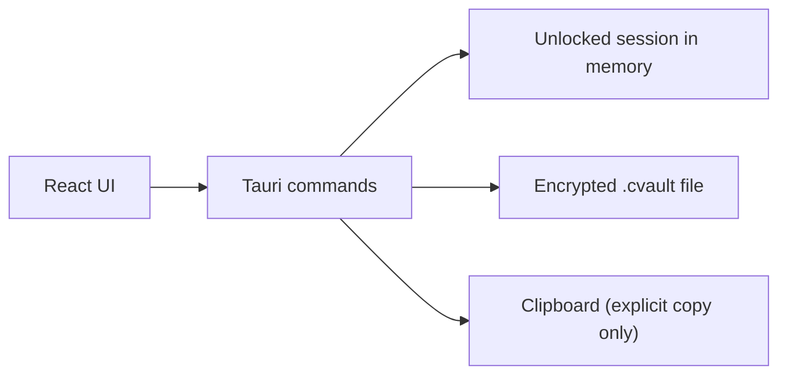

# Architecture

CodexVault is intentionally small:

- one desktop shell
- one React UI
- one Rust backend surface
- one encrypted vault file
- no backend services

## Goals

- Keep security-sensitive work in Rust.
- Keep the UI fast and local.
- Encrypt the full vault payload at rest.
- Require explicit user action for reveal, copy, and export flows.
- Stay understandable enough that a reviewer can inspect the important paths quickly.

## System overview

The default Tauri capability set stays narrow: core window runtime, file dialogs, and clipboard access for explicit copy actions.

## Process split

| Layer | Responsibility |
| --- | --- |
| `src/` | Window layout, filters, entry selection, modal forms, reveal/export presentation |
| `src-tauri/src/commands.rs` | Command surface for create, unlock, lock, CRUD, reveal, copy, export, settings |
| `src-tauri/src/crypto.rs` | `Argon2id`, `AES-256-GCM`, authenticated envelope creation and decryption |
| `src-tauri/src/storage.rs` | Vault load/save, path normalization, atomic encrypted writes |
| `src-tauri/src/exports.rs` | Render `.env`, generic JSON, OpenClaw env and bundle formats, and provider snippets |
| `src-tauri/src/prefs.rs` | Recent vault path preferences only |
| `src-tauri/src/demo.rs` | Repeatable encrypted demo-vault generation for screenshots and QA |

## Data flow

1. The UI asks Tauri dialogs for a vault path.
2. A create or unlock command runs in Rust.
3. Rust derives the key, decrypts or encrypts the payload, and stores the unlocked payload in process memory.
4. UI list and filter views receive metadata records only.
5. Secret values are returned only through explicit reveal, copy, or export actions.
6. Mutations re-encrypt the full payload and persist it atomically.
7. OpenClaw exports apply deterministic status-aware key selection before rendering output.

## Storage model

CodexVault stores a single encrypted JSON envelope on disk rather than a plaintext local database.

Why:

- the file is inspectable and easy to back up
- the whole payload can be encrypted uniformly
- the import/export story stays simple
- there is no second plaintext metadata store to explain away

Recent vault paths are stored separately in local preferences. They are not encrypted and are not part of the vault file.

## Trust boundaries

### At rest

- The `.cvault` file is encrypted.
- Metadata and secret values are encrypted together.
- App preferences are not part of the encrypted vault.

### In memory

- The unlocked payload exists in memory while the vault is unlocked.
- The renderer handles plaintext during explicit reveal, export preview, and entry submit flows.
- Clipboard clearing is best-effort only after explicit copy.

## UI structure

- Lock screen for create and unlock
- Filter sidebar for metadata search
- Entry list for operator scanning
- Details pane for secret actions, metadata, notes, and exports
- Modal editors for entries and vault settings
- Pre-copy OpenClaw selection report modal for explicit operator review

## Deliberate tradeoffs

- No plaintext file exports by default
- No background provider calls
- No live config mutation
- No claim of protection on a compromised host
